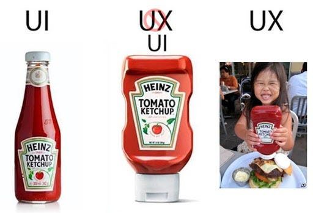

# Comms / UX / UI Design Redesign Project Week 2

Thr purpose of this week was to cover ... the stages of methodology and usability factors

### Five stages of 
Context: why do I need methodology? what are the stages? why are they important? What will they give me?

The first stage is to Emphathise with... We do this by identifying problems with people/users. Examples might be user stories and problem statements

after emphathising, we need to Define problems, analyzing/defining/articulation the problems from when we emphasized

Ideate - brainstorming, generating as many solutions as possible in a non-judmental way

Prototype - pick the best solutions and prototype them

Test - use the prototype to validate assumptions and get feedback

---

??? info "7 Usability Factors"

    - **Useful** — is a product/service useful?
    - **Usable** — is a product/service usable?
    - **Findable** — is a product/service findable?
    - **Credible** — is a product/service credible?
    - **Desirable** — is a product/service desirable?
    - **Accessible** — is a product/service accessible?
    - **Valuable** — is a product/service valuable?

---

### In Class Real-World UX/UI Ketchup Bottle Redesign

- A good example we went through in class was the UX improvement of the glass ketchup bottle. Old school glass ketchup bottles were poorly designed because users had difficulty getting ketchup out, often requiring shaking or hitting the bottle. This Caused frustration, mess, and wasted product.

- Over time, the design evolved into a plastic squeeze bottle with a cap that was also on the bottom of the bottle instead of the top. This redesign improved the user experience by allowing better control, easier dispensing, and being overall cleaner.

- Using what we in UX/UI design class to reflect on why we redesigned the traditional ketchup bottle

##### UX methodology

Having done the thing above, we followed the process. Heres what we discovered: 

- Empathize - We know that customers/users became frustrated with glass bottles.
- Define - The Problem was messy, inconsistent, and needed effort to use.
- Ideate - Find a way to change how the item was used, and make it overall more convenient, material and mechanisms were the main focal point.
- Prototype - They ended up having plastic squeeze bottles with a hole at the bottom that can by controlled with a squeeze.
- Test - Quickly customers/users would easily tell that the design was faster, cleaner, and easier.

---

##### Usability Factors

- Useful - Dispenses ketchup efficiently.
- Useable - Requires less effort and strength.
- Findable - Easy to locate opening cap and in stores/restaurants everywhere.
- Credible - Trusted brand and reliable function.
- Desirable - More modern and convenient.
- Accessible -  Easier for childen and people with limited strength.
- Valuable - Reduces the waste of ketchup and improves customer/user satisfaction.

---

---

#### UX in Everyday products

- UX design is not just limited to websites and apps, but everyday objects like ketchup bottles, remote controls, etc. A well designed product makes you never question it, while a poorly designed product forces customers/users think who designed this abomination.

---

#### The relationship between UX/UI and Business success

- Good UX/UI design directly impacts business. Products and services that are easier to use and are intuitive, increase customer/user satisfication, and reduce customer/user frustration. This also makes higher customer/user retention rate, which could correlate with overall more monthly customer/users, while also improving brand trust. While poor UX/UI design can mean a loss in customer/users, and negative outlooks, meaning that good UX/UI design inherently helps business profits.

---