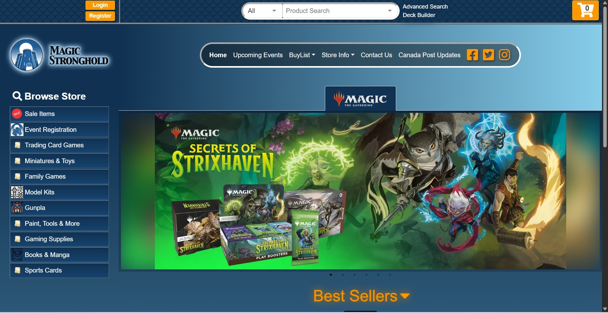
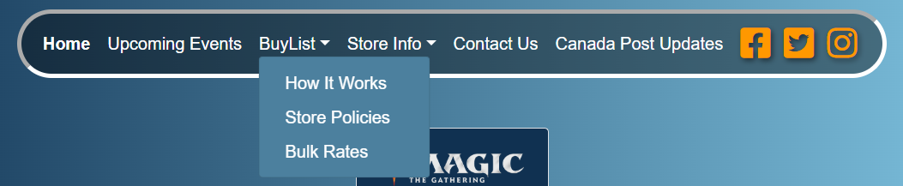
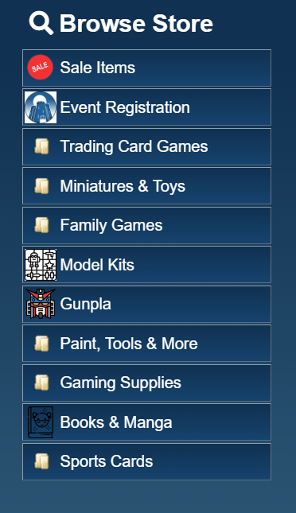
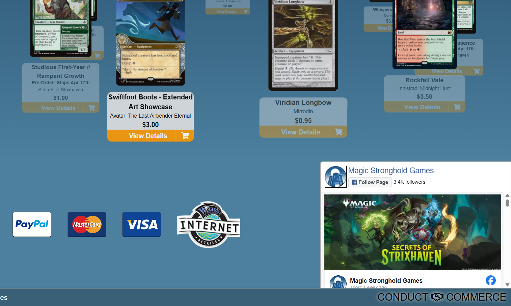

# Magic Stronghold Website Redesign

## Project Overview

This project focuses on analyzing and redesigning the Magic Stronghold website using UX and UI design principles. The goal is to improve usability, accessibility, visual hierarchy, and the overall user experience, while documenting the process.

The original website is an online storefront and event hub for trading card games, tournaments, and hobby products. However, the current design presents several usability challenges that affect how users navigate and interact with the site.

## Problems

The existing website has many issues that go against core UX/UI principles and Usability Heuristics.

<ul>
  <li>
    Outdated visual design that lacks consistency.
    
      View
      
    
  </li>

  <li>
    Unclear navigation structure, making it more difficult to find key information.
    
      View
      
    
  </li>

  <li>
    Poor visual hierarchy, where important elements are not highlighted.
    
      View
      
    
  </li>

  <li>
    Cluttered layout that reduces readability and usability.
    
      View
      
    
  </li>
</ul>

These problems make it harder for users to look for products, find events, and engage with the website effectively.

## Project Goals

The redesign is focusing on creating a more user-friendly exerience by:
- Simplifying and improving navigation.
- Creating consistent layouts across pages.
- Enhancing visual hierarchy and readability.
- Applying strong UX/UI design fundamentals.
- Improving accessibility for different users.
- Keeping in mind good usability heuristics.

## Team

This project was completed in a team of three.

